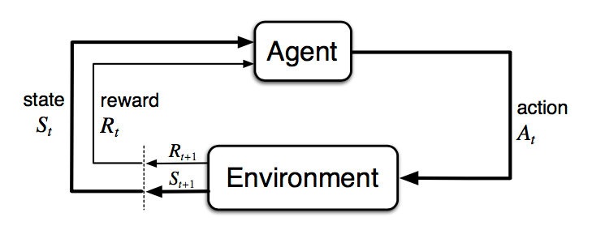
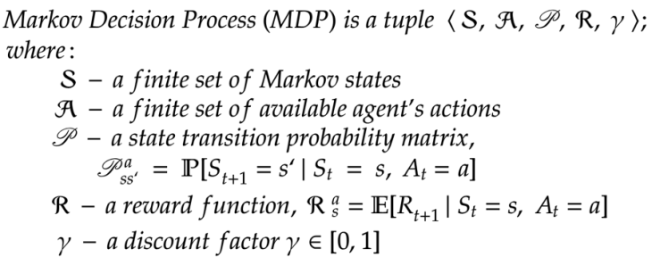

# Reinforcement Learning Algorithms
This is the series of Reinforcement Learning algorithms implemented in python and gym(gym fot environment).As of now, i have only implemented MDP(Markov Decision Process). It is in development stage. I will also write blogs in medium for each algorithm, i upload(MDP blogs are on the way). 
### What is Reinforcement Learning?
Reinforcement Learning is a type of Machine Learning, and thereby also a branch of Artificial Intelligence. It allows machines and software agents to automatically determine the ideal behaviour within a specific context, in order to maximize its performance. Simple reward feedback is required for the agent to learn its behaviour; this is known as the reinforcement signal.  

### Markov Decision Process
Markov Decision process is the door of reinforcement learning world. Formally MDP describe an environment for RL where environment is fully observable. Almost all RL problems can be formalized in to MDP.

### Contribution Guide:
You can see that we have only one algorithm in this repository, if you want to contribute follow this guidelines-
- Create an issue describing what you want to add.
- Make sure you follow proper indentation(4 space indentation).
- Proper commented code if required
- Create a PR for respective issue if required

#### References
  - [Introduction to Reinforcement Learning by David Silver, DeepMind](https://www.youtube.com/playlist?list=PLqYmG7hTraZDM-OYHWgPebj2MfCFzFObQ)
  - [Reinforcement Learning: An Introduction by Richard S. Sutton and Andrew G. Barto](Richard S. Sutton and Andrew G. Barto)
  - I have used various open source repositories to learn to implement Reinforcement Learning algorithms. Some are [aima-python](https://github.com/aimacode/aima-python), [ShangtomZhang repo](https://github.com/dshahid380/reinforcement-learning-an-introduction), 

     
`<Happy Coding/>`
